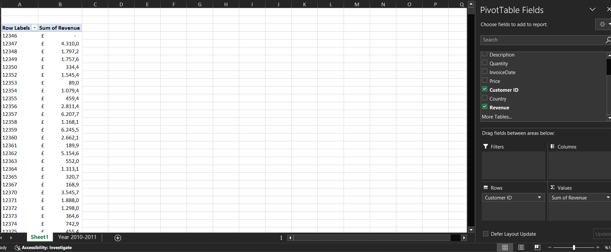
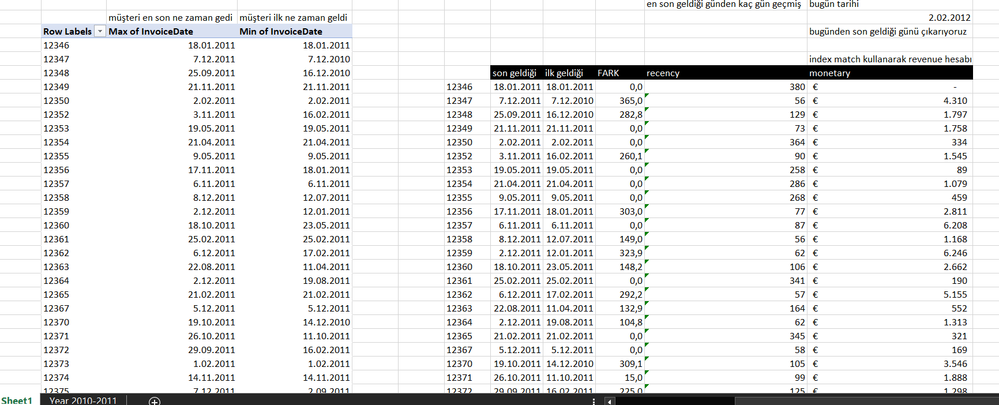
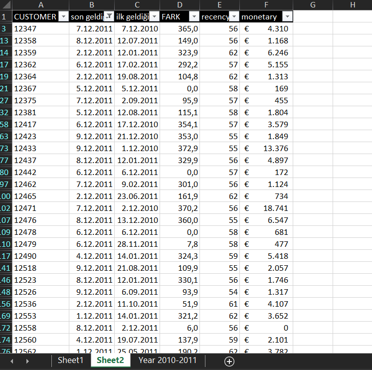

# 🛒 Müşteri Recency Analizi – Gerçek Müşteri Tespiti

## 🔍 Proje Özeti

Bu projede, **Online Retail II (2010–2011)** verisinden yararlanarak müşterilerin **alışveriş sıklığı ve en son geliş tarihleri** analiz edilmiştir. Amaç, **gerçek (sadık) müşterileri** belirlemektir.

### 🎯 Hedef Müşteri Profili

Gerçek müşteriler şu iki kritere göre tanımlanır:

1. **Recency**: En son alışverişinin üzerinden geçen gün sayısı az olanlar  
2. **Tekrar Alışveriş (FARK > 0)**: Müşteri ilk alışverişinden sonra ikinci kez alışveriş yapmışsa

---

## 📊 Kullanılan Veriler

- **Customer ID**: Müşteri kimliği
- **InvoiceDate**: Fatura tarihi (ilk ve son alışveriş için kullanıldı)
- **Revenue**: Toplam harcama (monetary)

---

## 📐 Hesaplama Mantığı

| Metrik     | Açıklama                                                              |
|------------|------------------------------------------------------------------------|
| `recency`  | Bugünün tarihi (02.02.2012) ile son alışveriş tarihi arasındaki fark  |
| `FARK`     | İlk ve son alışveriş tarihi arasındaki gün farkı                     |
| `monetary` | Müşterinin toplam harcaması (Pivot Table ile hesaplandı)             |

### 🔣 Örnek Excel Formülleri

**Recency Hesabı:**
```excel
=DATEDIF([@LastPurchase], DATE(2012,2,2), "D")
```

**Fark (İlk ve Son Geliş Arası Gün):**
```excel
=DATEDIF([@FirstPurchase], [@LastPurchase], "D")
```

---

## 📷 Ekran Görüntüleri

### 🧾 1. Pivot Table ile Revenue Hesabı


### 📦 2. Ham Fatura Verisi


### 📋 3. Recency ve FARK Tablosu


---

## 🧠 Sonuç ve Yorum

| Tip | Özellikleri |
|-----|-------------|
| **Gerçek Müşteri** | Recency düşük, FARK > 0, tekrar alışveriş yapmış |
| **Potansiyel Müşteri** | FARK = 0, sadece bir kez alışveriş yapmış olabilir |
| **Pasif Müşteri** | Recency çok yüksek, uzun süredir alışveriş yapmamış |

---

## 📁 Proje Klasör Yapısı

```bash
📦recency-analizi
 ┣ 📜README.md
 ┣ 📊Online_Retail_II_2010-11_Ham.xlsx
 ┗ 📁images/
     ┣ 📸recency_analysis_table.png
     ┣ 📸pivot_sum_revenue.png
     ┗ 📸raw_invoice_data.png
```

---

## 🚀 Geliştirme Önerileri

- RFM skorları ile segmentasyon (Recency-Frequency-Monetary)
- Power BI veya Python ile görselleştirme
- Güncel tarihli verilerle tekrar test
